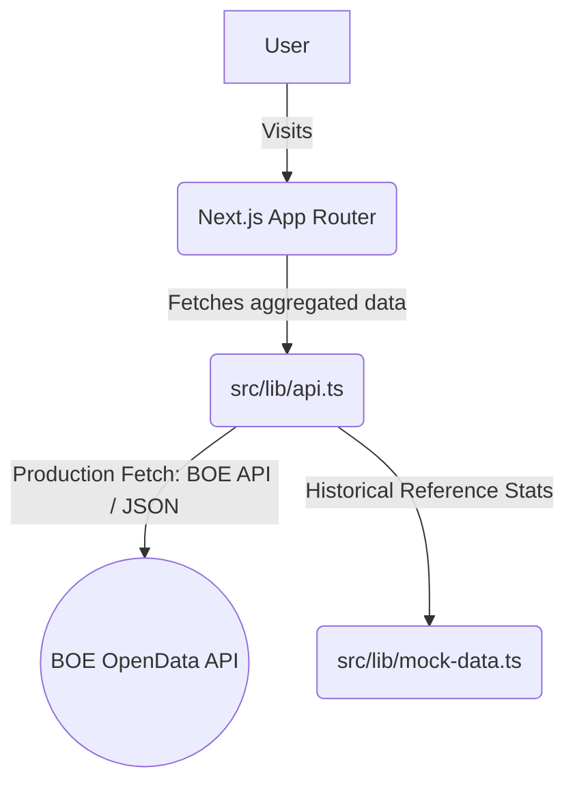

# Architecture Overview: Cuentas Claras

## Tech Stack
- **Framework**: Next.js 16.x (App Router)
- **Styling**: Tailwind CSS v4 (with custom CSS variables for themes)
- **UI Components**: Radix UI / Lucide React / Custom implementations
- **Data Visualization**: Recharts
- **Animations**: Framer Motion

## System Context Diagram

## Data Connectivity
- **Real-Time Feed**: Connected to `https://boe.es/datosabiertos/api/boe/sumario/`, fetching the latest daily contract and procurement announcements directly.
- **Aggregation Logic**: The system currenty performs a hybrid merge of active daily announcements with our validated reference dataset to ensure the UI remains fully populated with consistent trends and maps.

## Folder Structure
- `src/app`: Page components and routing (Dashboard, Search, Watchlist).
- `src/components/dashboard`: Data visualization components (MoneyMap, TrendChart, TopRecipients).
- `src/components/layout`: Navigation and layout structures (NavBar).
- `src/components/ui`: Reusable UI elements (`Tooltip`, etc).
- `src/lib`: Logic and data fetching layers (`api.ts`, `mock-data.ts`).
